Kaggle-Happiness prediction
================

The Happiness Dataset - basic exploration
=========================================

Set the seed and max digits, source functions

``` r
set.seed(123)
options(digits = 4)

source("./funcs.R") 
```

Load the dataset

Check number of rows and columns

``` r
data <- read.csv(file = "./train.csv", stringsAsFactors = T)

dim(data)
```

    ## [1] 4619  109

How many variables are numeric ?

``` r
table(sapply(data, function(x) is.numeric(x)))
```

    ## 
    ## FALSE  TRUE 
    ##   106     3

Which ones ?

``` r
names(data)[sapply(data, function(x) is.numeric(x))] 
```

    ## [1] "UserID" "YOB"    "Happy"

Check basic structure and summary for the 15 first variables

``` r
library(Hmisc)

describe(data)[1:15]
```

    ## data 
    ## 
    ##  15  Variables      4619  Observations
    ## ---------------------------------------------------------------------------
    ## UserID 
    ##       n missing  unique    Info    Mean     .05     .10     .25     .50 
    ##    4619       0    4619       1    3830   349.9   701.0  1769.5  3717.0 
    ##     .75     .90     .95 
    ##  5674.0  7104.2  7825.6 
    ## 
    ## lowest :    1    2    5    6    7, highest: 9449 9451 9469 9480 9503 
    ## ---------------------------------------------------------------------------
    ## YOB 
    ##       n missing  unique    Info    Mean     .05     .10     .25     .50 
    ##    3935     684      71       1    1979    1949    1956    1969    1982 
    ##     .75     .90     .95 
    ##    1992    1996    1998 
    ## 
    ## lowest : 1900 1932 1933 1936 1937, highest: 1999 2000 2001 2011 2039 
    ## ---------------------------------------------------------------------------
    ## Gender 
    ##       n missing  unique 
    ##    4619       0       3 
    ## 
    ##  (537, 12%), Female (1650, 36%), Male (2432, 53%) 
    ## ---------------------------------------------------------------------------
    ## Income 
    ##       n missing  unique 
    ##    4619       0       7 
    ## 
    ##  (1215, 26%), $100,001 - $150,000 (571, 12%) 
    ## $25,001 - $50,000 (545, 12%) 
    ## $50,000 - $74,999 (642, 14%) 
    ## $75,000 - $100,000 (567, 12%) 
    ## over $150,000 (536, 12%) 
    ## under $25,000 (543, 12%) 
    ## ---------------------------------------------------------------------------
    ## HouseholdStatus 
    ##       n missing  unique 
    ##    4619       0       7 
    ## 
    ##  (800, 17%), Domestic Partners (no kids) (118, 3%) 
    ## Domestic Partners (w/kids) (34, 1%) 
    ## Married (no kids) (522, 11%) 
    ## Married (w/kids) (1226, 27%) 
    ## Single (no kids) (1760, 38%) 
    ## Single (w/kids) (159, 3%) 
    ## ---------------------------------------------------------------------------
    ## EducationLevel 
    ##       n missing  unique 
    ##    4619       0       8 
    ## 
    ##  (1091, 24%), Associate's Degree (291, 6%) 
    ## Bachelor's Degree (935, 20%) 
    ## Current K-12 (607, 13%) 
    ## Current Undergraduate (557, 12%) 
    ## Doctoral Degree (148, 3%) 
    ## High School Diploma (487, 11%) 
    ## Master's Degree (503, 11%) 
    ## ---------------------------------------------------------------------------
    ## Party 
    ##       n missing  unique 
    ##    4619       0       6 
    ## 
    ##               Democrat Independent Libertarian Other Republican
    ## Frequency 728      926        1126         409   245       1185
    ## %          16       20          24           9     5         26
    ## ---------------------------------------------------------------------------
    ## Happy 
    ##       n missing  unique    Info     Sum    Mean 
    ##    4619       0       2    0.74    2604  0.5638 
    ## ---------------------------------------------------------------------------
    ## Q124742 
    ##       n missing  unique 
    ##    4619       0       3 
    ## 
    ##  (2563, 55%), No (1300, 28%), Yes (756, 16%) 
    ## ---------------------------------------------------------------------------
    ## Q124122 
    ##       n missing  unique 
    ##    4619       0       3 
    ## 
    ##  (1613, 35%), No (1233, 27%), Yes (1773, 38%) 
    ## ---------------------------------------------------------------------------
    ## Q123464 
    ##       n missing  unique 
    ##    4619       0       3 
    ## 
    ##  (1455, 32%), No (2966, 64%), Yes (198, 4%) 
    ## ---------------------------------------------------------------------------
    ## Q123621 
    ##       n missing  unique 
    ##    4619       0       3 
    ## 
    ##  (1524, 33%), No (1506, 33%), Yes (1589, 34%) 
    ## ---------------------------------------------------------------------------
    ## Q122769 
    ##       n missing  unique 
    ##    4619       0       3 
    ## 
    ##  (1333, 29%), No (2019, 44%), Yes (1267, 27%) 
    ## ---------------------------------------------------------------------------
    ## Q122770 
    ##       n missing  unique 
    ##    4619       0       3 
    ## 
    ##  (1211, 26%), No (1445, 31%), Yes (1963, 42%) 
    ## ---------------------------------------------------------------------------
    ## Q122771 
    ##       n missing  unique 
    ##    4619       0       3 
    ## 
    ##  (1201, 26%), Private (567, 12%), Public (2851, 62%) 
    ## ---------------------------------------------------------------------------

Preprocessing 1
===============

Use label "N/A" for all the skipped questions instead of having blanks

``` r
for (i in names(data[3:109])) {
    levels(data[,i]) <- c(levels(data[,i]), "N/A")
    data[,i][data[,i] == ''] <- "N/A"
}
```

See some summaries for selected variables.

``` r
summary(data[, 2:8])
```

    ##       YOB          Gender                     Income    
    ##  Min.   :1900         :   0   N/A                :1215  
    ##  1st Qu.:1969   Female:1650   $50,000 - $74,999  : 642  
    ##  Median :1982   Male  :2432   $100,001 - $150,000: 571  
    ##  Mean   :1979   N/A   : 537   $75,000 - $100,000 : 567  
    ##  3rd Qu.:1992                 $25,001 - $50,000  : 545  
    ##  Max.   :2039                 under $25,000      : 543  
    ##  NA's   :684                  (Other)            : 536  
    ##                     HouseholdStatus               EducationLevel
    ##  Single (no kids)           :1760   N/A                  :1091  
    ##  Married (w/kids)           :1226   Bachelor's Degree    : 935  
    ##  N/A                        : 800   Current K-12         : 607  
    ##  Married (no kids)          : 522   Current Undergraduate: 557  
    ##  Single (w/kids)            : 159   Master's Degree      : 503  
    ##  Domestic Partners (no kids): 118   High School Diploma  : 487  
    ##  (Other)                    :  34   (Other)              : 439  
    ##          Party         Happy          
    ##             :   0   Length:4619       
    ##  Democrat   : 926   Class :character  
    ##  Independent:1126   Mode  :character  
    ##  Libertarian: 409                     
    ##  Other      : 245                     
    ##  Republican :1185                     
    ##  N/A        : 728

Check NAs in the YOB variable

``` r
table(is.na(data))   # 684 NA values all in the YOB
```

    ## 
    ##  FALSE   TRUE 
    ## 502787    684

Create Cross table

``` r
# library(gmodels)
# 
# CrossTable(data$Happy, data$Gender)
```

Ftable (similar) between hapiness and gender

``` r
mytable <- xtabs(~ Gender+Income+Happy, data=data)


ftable(mytable)
```

    ##                            Happy   0   1
    ## Gender Income                           
    ##                                    0   0
    ##        $100,001 - $150,000         0   0
    ##        $25,001 - $50,000           0   0
    ##        $50,000 - $74,999           0   0
    ##        $75,000 - $100,000          0   0
    ##        over $150,000               0   0
    ##        under $25,000               0   0
    ##        N/A                         0   0
    ## Female                             0   0
    ##        $100,001 - $150,000        76 135
    ##        $25,001 - $50,000         118 108
    ##        $50,000 - $74,999         121 144
    ##        $75,000 - $100,000         86 132
    ##        over $150,000              71 102
    ##        under $25,000             113  93
    ##        N/A                       170 181
    ## Male                               0   0
    ##        $100,001 - $150,000       129 225
    ##        $25,001 - $50,000         163 151
    ##        $50,000 - $74,999         149 218
    ##        $75,000 - $100,000        141 204
    ##        over $150,000             131 225
    ##        under $25,000             170 163
    ##        N/A                       162 201
    ## N/A                                0   0
    ##        $100,001 - $150,000         2   4
    ##        $25,001 - $50,000           4   1
    ##        $50,000 - $74,999           6   4
    ##        $75,000 - $100,000          3   1
    ##        over $150,000               1   6
    ##        under $25,000               0   4
    ##        N/A                       199 302

YOB variable

Are there any missing values ?

``` r
head(as.data.frame(data$YOB))
```

    ##   data$YOB
    ## 1     1938
    ## 2     1985
    ## 3     1963
    ## 4     1997
    ## 5     1996
    ## 6     1991

``` r
table(is.na(data$YOB)) 
```

    ## 
    ## FALSE  TRUE 
    ##  3935   684

Missing value imputation & Preproc 2
====================================

Impute missing values

-   Convert YOB to age
-   Ages to different age buckets
-   Convert age and happy vars to factors
-   Rename dataset

``` r
data_age <- data_age %>%
    rowwise() %>% 
    mutate(Age=convert_age(Age))


data_age$Age <- as.factor(data_age$Age)
data_age$Happy <- as.factor(data_age$Happy )

## 
happy_data <- data_age
```

Print the first rows of the new age column

``` r
#saveRDS(happy_data, file="happy_data.Rds")

head(data.frame(happy_data$Age))
```

    ##   happy_data.Age
    ## 1   older senior
    ## 2    young adult
    ## 3    middle-aged
    ## 4       underage
    ## 5       underage
    ## 6    young adult

Add a new variable that represents the total number of skipped questions per person

``` r
happy_data$numberSkipped <- apply(happy_data, MARGIN = 1, function (x) sum(x=="N/A"))

happy_data["numberSkipped"]
```

    ## Source: local data frame [4,619 x 1]
    ## 
    ##    numberSkipped
    ##            (int)
    ## 1             17
    ## 2             35
    ## 3              2
    ## 4              3
    ## 5              4
    ## 6             19
    ## 7             33
    ## 8              0
    ## 9              0
    ## 10            57
    ## ..           ...

Graphs for Exploratory analysis
===============================

How does happiness correlate with gender ? Mosaic Plot and contigency table

``` r
library(vcd)

plot(as.factor(happy_data$Happy), as.factor(happy_data$Gender), xlab="Happy?" , ylab="Gender")
```

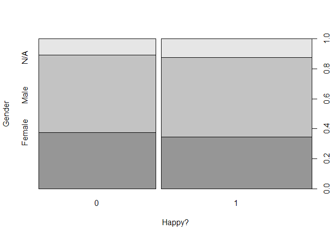

Box plots with age as numerical

``` r
library(ggplot2)
library(gridExtra)

data_age_num$Happy <- as.factor(data_age_num$Happy)

q1 <- qplot(Happy, Age, fill=Happy, data=happy_data, geom = c("boxplot","jitter"))

q2 <- qplot(Happy, Age, fill=Happy, data=data_age_num, geom = c("boxplot","jitter"))
q3 <- qplot(Happy, Age, fill=Happy, data=data_age_num, geom = c("boxplot"))

grid.arrange(q1, q2, q3, ncol=3)
```

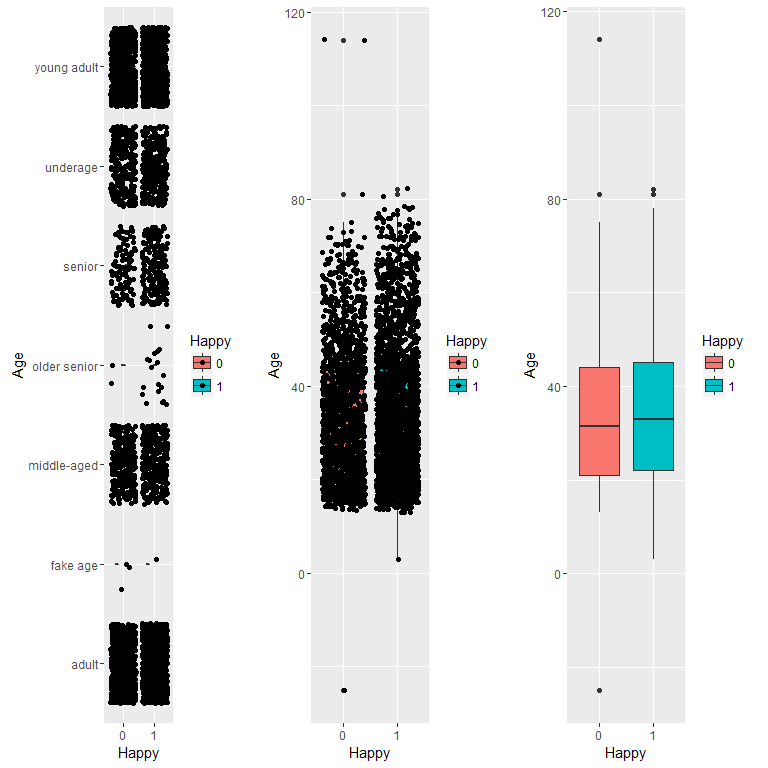

Preproc 3
=========

Add a new variable representing the number of time respondents replied in positive way in the top 10 important questions.

Break down this new variable by happy/unhappy

``` r
add_positive <- function (x) {

sum(as.character(data$Q118237[x])=="No" , as.character(data$Q101162[x])=="Optimist",
as.character(data$Q107869[x])=="Yes", 
as.character(data$Q119334[x])=="Yes" , 
as.character(data$Q102289[x])=="Yes",
as.character(data$Q102906[x])=="No" , 
as.character(data$Q120014[x])=="Yes", 
as.character(data$Q98869[x])=="Yes", 
as.character(data$Q121011[x])=="No",
as.character(data$Q106997[x])=="Yay people!")  
}


ans <- sapply(seq_len(nrow(data)), add_positive) 

mytable <- table(happy_data$Happy, ans)

prop.table(mytable,2)*100
```

    ##    ans
    ##         0     1     2     3     4     5     6     7     8     9    10
    ##   0 67.71 58.84 50.45 51.51 42.20 42.86 29.89 23.82 17.26 10.00 12.50
    ##   1 32.29 41.16 49.55 48.49 57.80 57.14 70.11 76.18 82.74 90.00 87.50

``` r
happy_data$KeyPositiveAns <- ans
```

Feature selection
=================

With Boruta

``` r
# boruta.train <- Boruta(Happy~.-UserID, data = data_age, doTrace = 2, maxRuns = 20)
# 
# print(boruta.train)
# 
# boruta.train$finalDecision
# 
# saveRDS(boruta.train$finalDecision, file="boruta.Rds")
```

A tree fitted on the whole data set

``` r
library(rpart)
library(rpart.plot)
library(partykit)
# 
# 
# tree=rpart(Happy~., data=happy_data, method="class")
# prp(tree)
# 
# 
# plot(as.party(tree))
# 
# 
```

Same with fancyRplot

``` r
library(rattle)
```

    ## Rattle: A free graphical interface for data mining with R.
    ## Version 3.4.1 Copyright (c) 2006-2014 Togaware Pty Ltd.
    ## Type 'rattle()' to shake, rattle, and roll your data.

``` r
#fancyRpartPlot(tree)
```

Identify Variables of high relative importance
==============================================

with Random Forests

``` r
library(randomForest)
```

    ## randomForest 4.6-10

    ## Type rfNews() to see new features/changes/bug fixes.

    ## 
    ## Attaching package: 'randomForest'

    ## The following object is masked from 'package:dplyr':
    ## 
    ##     combine

    ## The following object is masked from 'package:Hmisc':
    ## 
    ##     combine

    ## The following object is masked from 'package:ggplot2':
    ## 
    ##     margin

``` r
rfor <- randomForest(Happy~., data=happy_data[2:110], ntree=100, nodesize=1, type="class")
varImp <- importance(rfor)
varImpPlot(rfor, main = "RForest-based Variable Importance Plot")
```

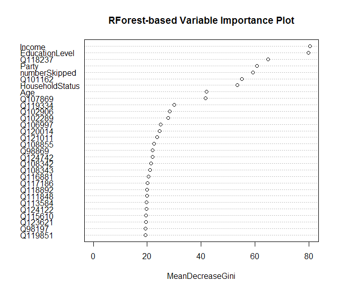 The top 25 selected variables in order of importance

``` r
selVars <- names(sort(varImp[,1], decreasing=T))[1:25]

selVars
```

    ##  [1] "Income"          "EducationLevel"  "Q118237"        
    ##  [4] "Party"           "numberSkipped"   "Q101162"        
    ##  [7] "HouseholdStatus" "Age"             "Q107869"        
    ## [10] "Q119334"         "Q102906"         "Q102289"        
    ## [13] "Q106997"         "Q120014"         "Q121011"        
    ## [16] "Q108855"         "Q98869"          "Q124742"        
    ## [19] "Q108342"         "Q108343"         "Q116881"        
    ## [22] "Q117186"         "Q118892"         "Q111848"        
    ## [25] "Q113584"

With Caret rfe

Predictive modeling
===================

load parallel libs and other related packages

``` r
library(doParallel)
registerDoParallel(4,cores=4)
getDoParWorkers()
```

    ## [1] 4

``` r
library(caret)
library(corrplot)
library(pROC)
library(ROCR)


set.seed(123)
```

Split data
==========

Split the dataset in test and train

``` r
trainIndex <-  createDataPartition(happy_data$Happy,p=.70,list=FALSE)

trainData <-  happy_data[trainIndex,-1]   #leave out userID

testData  <- happy_data[-trainIndex, -1]

trainX <- trainData[,-7]  #leave out the response
testX <-  testData[,-7]


# for some algorithms to work need to follow the step below

trainData$Happy <-  ifelse(trainData$Happy=="1","Happy","Unhappy")
testData$Happy <-  ifelse(testData$Happy=="1","Happy","Unhappy")
testData$Happy <-  as.factor(testData$Happy)
trainData$Happy <-  as.factor(trainData$Happy)

class(trainData$Happy)
```

    ## [1] "factor"

Set the caret control params

``` r
# ctrl <-  trainControl(method="repeatedcv", # 10fold cross validation
#                      repeats=3, # do 3 repititions of cv
#                      summaryFunction=twoClassSummary, # Use AUC to pick the best model
#                      classProbs=TRUE)
# 
cvCtrl <- trainControl(method = "repeatedcv",
                       repeats = 3,
                       summaryFunction = twoClassSummary,
                       classProbs = TRUE)
```

s

``` r
# ctrl <-  trainControl(method="cv", # 10fold cross validation,
#                       number=4,
#                      #repeats=3, # do 3 repititions of cv
#                      summaryFunction=twoClassSummary, # Use AUC to pick the best model
#                      classProbs=TRUE)

# cvCtrl <- trainControl(method = "cv", 
#                        number=4,
#                        #repeats = 3,
#                        summaryFunction = twoClassSummary,
#                        classProbs = TRUE)
```

(load data if already stored in file)

``` r
# gbm.mod <- readRDS("gbm.mod.rds")
# nbFit <- readRDS("nbFit.rds")
# rf.tune <- readRDS("rf.tune.rds")
# rpartTune <- readRDS("rpartTune.rds")
# svm.tune <- readRDS("svm.tune.rds")
```

RF
==

Train RF function

``` r
rf.tune <- train(x=trainX,
                y= trainData$Happy,
                #tuneLength = 5, # Here we can add our own grid
                method="rf",
                trControl= cvCtrl,
                prox=TRUE,allowParallel=TRUE)
```

    ## Warning in train.default(x = trainX, y = trainData$Happy, method = "rf", :
    ## The metric "Accuracy" was not in the result set. ROC will be used instead.

Inspect model

``` r
rf.tune
```

    ## Random Forest 
    ## 
    ## 3234 samples
    ##  109 predictor
    ##    2 classes: 'Happy', 'Unhappy' 
    ## 
    ## No pre-processing
    ## Resampling: Cross-Validated (10 fold, repeated 3 times) 
    ## Summary of sample sizes: 2911, 2911, 2911, 2910, 2910, 2911, ... 
    ## Resampling results across tuning parameters:
    ## 
    ##   mtry  ROC     Sens    Spec  
    ##     2   0.7248  0.8711  0.3940
    ##    55   0.7305  0.7851  0.5455
    ##   109   0.7284  0.7784  0.5499
    ## 
    ## ROC was used to select the optimal model using  the largest value.
    ## The final value used for the model was mtry = 55.

``` r
saveRDS(rf.tune, "./rf.tune.rds")
```

The final model

``` r
rf.tune$finalModel   
```

    ## 
    ## Call:
    ##  randomForest(x = x, y = y, mtry = param$mtry, proximity = TRUE,      allowParallel = TRUE) 
    ##                Type of random forest: classification
    ##                      Number of trees: 500
    ## No. of variables tried at each split: 55
    ## 
    ##         OOB estimate of  error rate: 32.13%
    ## Confusion matrix:
    ##         Happy Unhappy class.error
    ## Happy    1423     400      0.2194
    ## Unhappy   639     772      0.4529

``` r
plot(rf.tune,
     metric="ROC",
     scales=list(x=list(log=2)))
```

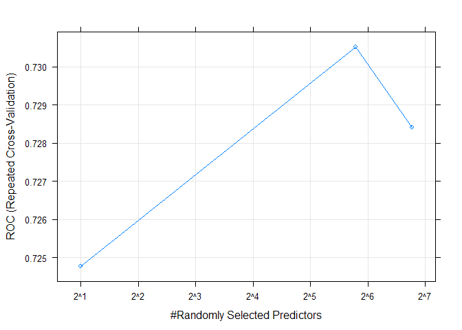

Similar with ggplot

``` r
#ggplot(rf.tune)  + theme(legend.position="top")
```

Random Forest Predictions

``` r
rf.pred <-  predict(rf.tune,testX)
head(rf.pred)
```

    ## [1] Happy   Happy   Unhappy Happy   Happy   Happy  
    ## Levels: Happy Unhappy

Conf.M / Probs/ AUC
===================

``` r
confusionMatrix(rf.pred,testData$Happy)
```

    ## Confusion Matrix and Statistics
    ## 
    ##           Reference
    ## Prediction Happy Unhappy
    ##    Happy     603     272
    ##    Unhappy   178     332
    ##                                      
    ##                Accuracy : 0.675      
    ##                  95% CI : (0.65, 0.7)
    ##     No Information Rate : 0.564      
    ##     P-Value [Acc > NIR] : < 2e-16    
    ##                                      
    ##                   Kappa : 0.328      
    ##  Mcnemar's Test P-Value : 1.16e-05   
    ##                                      
    ##             Sensitivity : 0.772      
    ##             Specificity : 0.550      
    ##          Pos Pred Value : 0.689      
    ##          Neg Pred Value : 0.651      
    ##              Prevalence : 0.564      
    ##          Detection Rate : 0.435      
    ##    Detection Prevalence : 0.632      
    ##       Balanced Accuracy : 0.661      
    ##                                      
    ##        'Positive' Class : Happy      
    ## 

Probs

``` r
rf.probs <-  predict(rf.tune,testX,type="prob")
head(rf.probs)
```

    ##   Happy Unhappy
    ## 1 0.718   0.282
    ## 2 0.508   0.492
    ## 3 0.332   0.668
    ## 4 0.810   0.190
    ## 5 0.910   0.090
    ## 6 0.646   0.354

AUC score

``` r
rf.ROC <-  roc(predictor=rf.probs$Happy,
              response=testData$Happy,
              levels=rev(levels(testData$Happy)))

rf.ROC
```

    ## 
    ## Call:
    ## roc.default(response = testData$Happy, predictor = rf.probs$Happy,     levels = rev(levels(testData$Happy)))
    ## 
    ## Data: rf.probs$Happy in 604 controls (testData$Happy Unhappy) < 781 cases (testData$Happy Happy).
    ## Area under the curve: 0.734

ROC Curve

``` r
plot(rf.ROC,main = "Random Forest ROC")
```

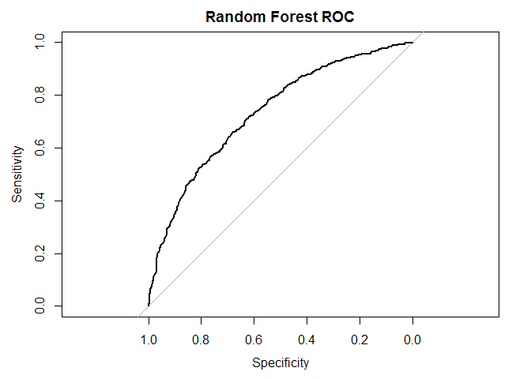

    ## 
    ## Call:
    ## roc.default(response = testData$Happy, predictor = rf.probs$Happy,     levels = rev(levels(testData$Happy)))
    ## 
    ## Data: rf.probs$Happy in 604 controls (testData$Happy Unhappy) < 781 cases (testData$Happy Happy).
    ## Area under the curve: 0.734

CART
====

Similar for CART

``` r
rpartTune <- train(x=trainX,
                   y= trainData$Happy, method = "rpart",
                   tuneLength = 5,
                   metric = "ROC",   # can we add accuracy  ?
                   trControl = cvCtrl)
```

``` r
rpartTune
```

    ## CART 
    ## 
    ## 3234 samples
    ##  109 predictor
    ##    2 classes: 'Happy', 'Unhappy' 
    ## 
    ## No pre-processing
    ## Resampling: Cross-Validated (10 fold, repeated 3 times) 
    ## Summary of sample sizes: 2911, 2910, 2910, 2911, 2911, 2911, ... 
    ## Resampling results across tuning parameters:
    ## 
    ##   cp        ROC     Sens    Spec  
    ##   0.008505  0.6614  0.7339  0.5384
    ##   0.009568  0.6502  0.7316  0.5414
    ##   0.009922  0.6404  0.7334  0.5414
    ##   0.048901  0.4368  0.8170  0.4035
    ##   0.090007  0.4140  0.9108  0.1931
    ## 
    ## ROC was used to select the optimal model using  the largest value.
    ## The final value used for the model was cp = 0.008505.

``` r
saveRDS(rpartTune, "./rpartTune.rds")
```

``` r
plot(rpartTune, scales = list(x = list(log = 10)))
```

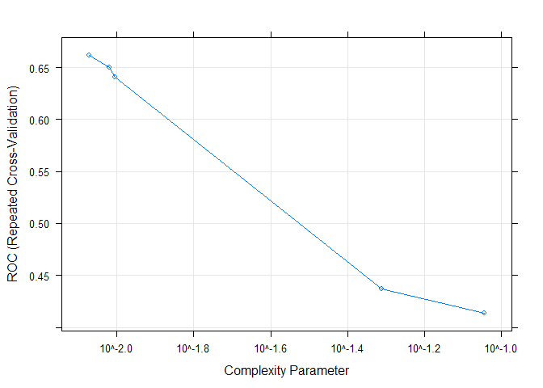

``` r
fancyRpartPlot(rpartTune$finalModel)
```

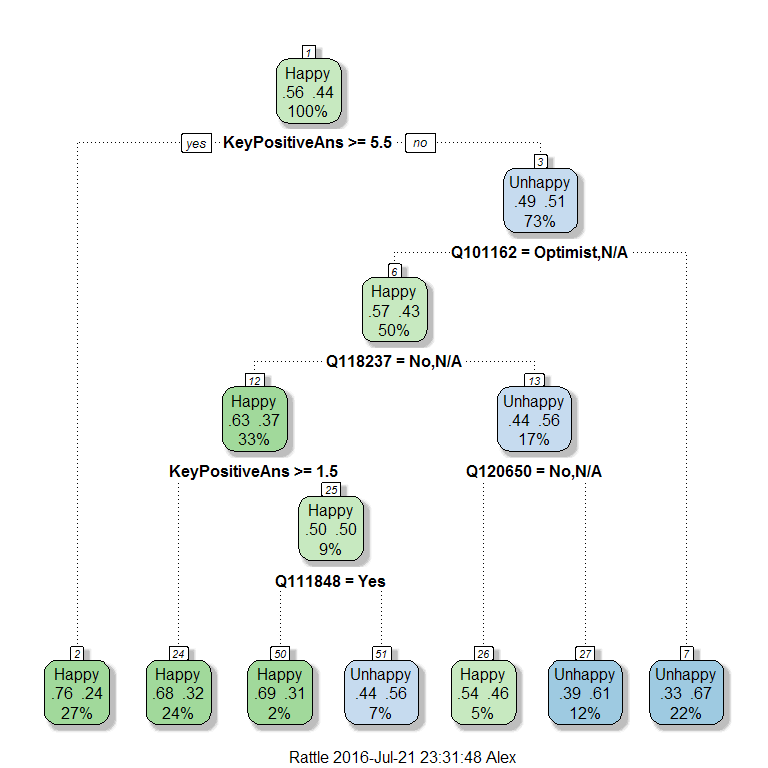

``` r
rpartPred2 <- predict(rpartTune, testX)


confusionMatrix(rpartPred2, testData$Happy)
```

    ## Confusion Matrix and Statistics
    ## 
    ##           Reference
    ## Prediction Happy Unhappy
    ##    Happy     563     253
    ##    Unhappy   218     351
    ##                                         
    ##                Accuracy : 0.66          
    ##                  95% CI : (0.634, 0.685)
    ##     No Information Rate : 0.564         
    ##     P-Value [Acc > NIR] : 1.9e-13       
    ##                                         
    ##                   Kappa : 0.304         
    ##  Mcnemar's Test P-Value : 0.117         
    ##                                         
    ##             Sensitivity : 0.721         
    ##             Specificity : 0.581         
    ##          Pos Pred Value : 0.690         
    ##          Neg Pred Value : 0.617         
    ##              Prevalence : 0.564         
    ##          Detection Rate : 0.406         
    ##    Detection Prevalence : 0.589         
    ##       Balanced Accuracy : 0.651         
    ##                                         
    ##        'Positive' Class : Happy         
    ## 

``` r
rpartProbs <- predict(rpartTune, testX, type = "prob")

rpartROC <- roc(testData$Happy, rpartProbs[, "Happy"], levels = rev(levels(testData$Happy)))

rpartROC
```

    ## 
    ## Call:
    ## roc.default(response = testData$Happy, predictor = rpartProbs[,     "Happy"], levels = rev(levels(testData$Happy)))
    ## 
    ## Data: rpartProbs[, "Happy"] in 604 controls (testData$Happy Unhappy) < 781 cases (testData$Happy Happy).
    ## Area under the curve: 0.681

``` r
plot(rpartROC, print.thres = .5)
```

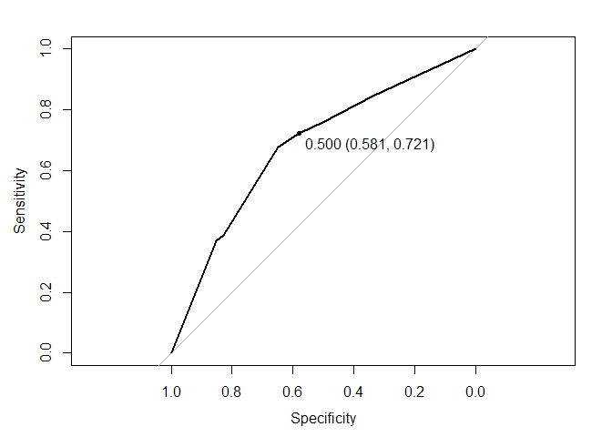

    ## 
    ## Call:
    ## roc.default(response = testData$Happy, predictor = rpartProbs[,     "Happy"], levels = rev(levels(testData$Happy)))
    ## 
    ## Data: rpartProbs[, "Happy"] in 604 controls (testData$Happy Unhappy) < 781 cases (testData$Happy Happy).
    ## Area under the curve: 0.681

Plot the propability of poor segmentation

``` r
histogram(~rpartProbs$Happy|testData$Happy,xlab="Probability of Poor Segmentation")
```

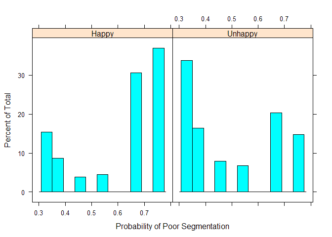

Naive Bayes
===========

Naive Bayes

``` r
# 2 repeats only here...
# nbFit <- train(x=trainX, y= trainData$Happy, method = "nb", tuneLength = 3,
#                metric = "ROC",   
#                trControl = cvCtrl)

# nbFit <- train(Happy ~ ., data=trainData, method = "nb", tuneLength = 3,
#                metric = "ROC",   
#                trControl = cvCtrl)
# 
# 
# 
```

``` r
# nbFit
# saveRDS(nbFit, "./nbFit.rds")
```

``` r
# nbProbs <- predict(nbFit, testX, type = "prob")
# 
# nbROC <- roc(testData$Happy, nbProbs[, "Happy"], levels = rev(levels(testData$Happy)))
```

SVM
===

``` r
# cvCtrl <- trainControl(method = "repeatedcv", repeats = 3,
# summaryFunction = twoClassSummary,
# classProbs = TRUE)


#20 mins here all we need to do is change the formula. 

# 3 repeats

svm.tune <- train(Happy ~ .,
                  data=trainData,
                  method = "svmRadial",    # Radial kernel
                  tuneLength = 2,                   # 9 values of the cost function
                  preProc = c("center","scale"),  # Center and scale data
                  metric="ROC",  
                  trControl=cvCtrl
                  )  
```

    ## Loading required package: kernlab

    ## 
    ## Attaching package: 'kernlab'

    ## The following object is masked from 'package:ggplot2':
    ## 
    ##     alpha

``` r
svm.tune
```

    ## Support Vector Machines with Radial Basis Function Kernel 
    ## 
    ## 3234 samples
    ##  109 predictor
    ##    2 classes: 'Happy', 'Unhappy' 
    ## 
    ## Pre-processing: centered (342), scaled (342) 
    ## Resampling: Cross-Validated (10 fold, repeated 3 times) 
    ## Summary of sample sizes: 2911, 2910, 2910, 2910, 2911, 2911, ... 
    ## Resampling results across tuning parameters:
    ## 
    ##   C     ROC     Sens    Spec  
    ##   0.25  0.7305  0.7623  0.5474
    ##   0.50  0.7337  0.7709  0.5488
    ## 
    ## Tuning parameter 'sigma' was held constant at a value of 0.001606
    ## ROC was used to select the optimal model using  the largest value.
    ## The final values used for the model were sigma = 0.001606 and C = 0.5.

``` r
saveRDS(svm.tune, "./svm.tune.rds")
```

``` r
svmProbs <- predict(svm.tune, testX, type = "prob")

svmROC <- roc(testData$Happy, svmProbs[, "Happy"], levels = rev(levels(testData$Happy)))
```

GBM
===

``` r
# 2 repeats
# trainX$Age <- as.factor(trainX$Age)
# 
# gbm.mod <- train(x=trainX,y=trainData$Happy,
# method = "gbm",
# metric = "ROC",
# trControl = cvCtrl,
# verbose=FALSE)

gbm.mod <- train(Happy ~ .,
                 data=trainData,
                 method = "gbm",
                 metric = "ROC",
                 trControl = cvCtrl,
                 verbose=FALSE)
```

    ## Loading required package: gbm

    ## Loading required package: splines

    ## Loaded gbm 2.1.1

    ## Loading required package: plyr

    ## -------------------------------------------------------------------------

    ## You have loaded plyr after dplyr - this is likely to cause problems.
    ## If you need functions from both plyr and dplyr, please load plyr first, then dplyr:
    ## library(plyr); library(dplyr)

    ## -------------------------------------------------------------------------

    ## 
    ## Attaching package: 'plyr'

    ## The following objects are masked from 'package:dplyr':
    ## 
    ##     arrange, count, desc, failwith, id, mutate, rename, summarise,
    ##     summarize

    ## The following objects are masked from 'package:Hmisc':
    ## 
    ##     is.discrete, summarize

``` r
gbm.mod
```

    ## Stochastic Gradient Boosting 
    ## 
    ## 3234 samples
    ##  109 predictor
    ##    2 classes: 'Happy', 'Unhappy' 
    ## 
    ## No pre-processing
    ## Resampling: Cross-Validated (10 fold, repeated 3 times) 
    ## Summary of sample sizes: 2911, 2911, 2911, 2910, 2911, 2909, ... 
    ## Resampling results across tuning parameters:
    ## 
    ##   interaction.depth  n.trees  ROC     Sens    Spec  
    ##   1                   50      0.7311  0.8175  0.4985
    ##   1                  100      0.7375  0.7992  0.5330
    ##   1                  150      0.7395  0.7897  0.5464
    ##   2                   50      0.7358  0.8036  0.5214
    ##   2                  100      0.7373  0.7848  0.5493
    ##   2                  150      0.7370  0.7802  0.5580
    ##   3                   50      0.7375  0.7972  0.5370
    ##   3                  100      0.7384  0.7824  0.5620
    ##   3                  150      0.7361  0.7742  0.5677
    ## 
    ## Tuning parameter 'shrinkage' was held constant at a value of 0.1
    ## 
    ## Tuning parameter 'n.minobsinnode' was held constant at a value of 10
    ## ROC was used to select the optimal model using  the largest value.
    ## The final values used for the model were n.trees = 150,
    ##  interaction.depth = 1, shrinkage = 0.1 and n.minobsinnode = 10.

``` r
saveRDS(gbm.mod, "./gbm.mod.rds")
```

``` r
ggplot(gbm.mod)
```

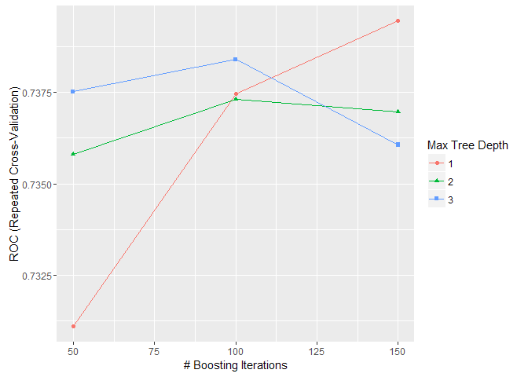

``` r
gbmProbs <- predict(gbm.mod, testX, type = "prob") 

gbmROC <- roc(testData$Happy, gbmProbs[, "Happy"], levels = rev(levels(testData$Happy))) 
```

Comparisons
===========

``` r
plot(rpartROC, col="red", lty=5, main="5 model AUC comparison plot")
```

    ## 
    ## Call:
    ## roc.default(response = testData$Happy, predictor = rpartProbs[,     "Happy"], levels = rev(levels(testData$Happy)))
    ## 
    ## Data: rpartProbs[, "Happy"] in 604 controls (testData$Happy Unhappy) < 781 cases (testData$Happy Happy).
    ## Area under the curve: 0.681

``` r
plot(rf.ROC, add = TRUE, col = "green", lty=4)
```

    ## 
    ## Call:
    ## roc.default(response = testData$Happy, predictor = rf.probs$Happy,     levels = rev(levels(testData$Happy)))
    ## 
    ## Data: rf.probs$Happy in 604 controls (testData$Happy Unhappy) < 781 cases (testData$Happy Happy).
    ## Area under the curve: 0.734

``` r
#plot(nbROC, add = TRUE, col = "yellow", lty=3)
plot(svmROC, add = TRUE, col = "gray", lty=2)
```

    ## 
    ## Call:
    ## roc.default(response = testData$Happy, predictor = svmProbs[,     "Happy"], levels = rev(levels(testData$Happy)))
    ## 
    ## Data: svmProbs[, "Happy"] in 604 controls (testData$Happy Unhappy) < 781 cases (testData$Happy Happy).
    ## Area under the curve: 0.742

``` r
plot(gbmROC, add = TRUE, col = "blue", lty=1)
```

    ## 
    ## Call:
    ## roc.default(response = testData$Happy, predictor = gbmProbs[,     "Happy"], levels = rev(levels(testData$Happy)))
    ## 
    ## Data: gbmProbs[, "Happy"] in 604 controls (testData$Happy Unhappy) < 781 cases (testData$Happy Happy).
    ## Area under the curve: 0.742

``` r
legend("topleft", title='model(AUC)', 
       c('gbm (0.744)', 'svm (0.742)',  'rForests (0.734)', 'cart (0.681)') , 
         lty =c(1,2,3,4), 
       col = c("blue","yellow", "green", "red"))    
```

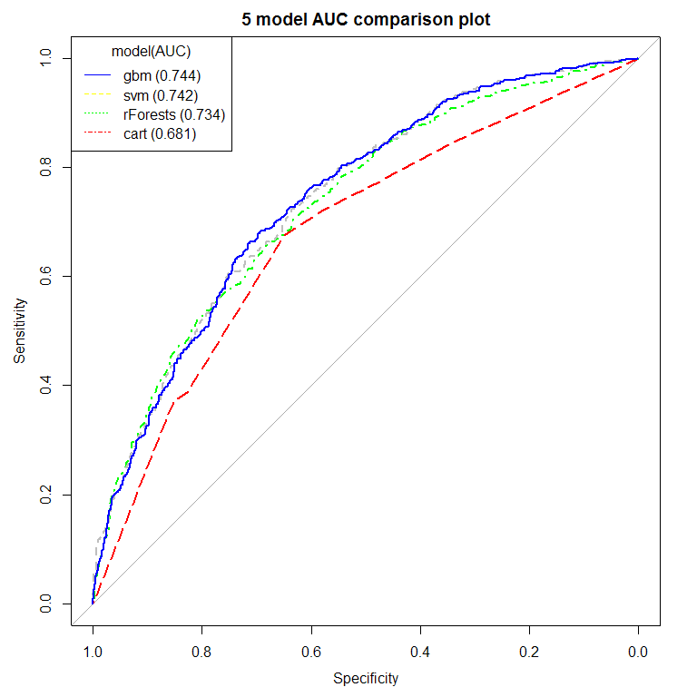

``` r
getTrainPerf(rf.tune)
```

    ##   TrainROC TrainSens TrainSpec method
    ## 1   0.7305    0.7851    0.5455     rf

``` r
getTrainPerf(rpartTune)
```

    ##   TrainROC TrainSens TrainSpec method
    ## 1   0.6614    0.7339    0.5384  rpart

``` r
getTrainPerf(rf.tune)
```

    ##   TrainROC TrainSens TrainSpec method
    ## 1   0.7305    0.7851    0.5455     rf

``` r
getTrainPerf(gbm.mod)
```

    ##   TrainROC TrainSens TrainSpec method
    ## 1   0.7395    0.7897    0.5464    gbm

``` r
getTrainPerf(svm.tune)
```

    ##   TrainROC TrainSens TrainSpec    method
    ## 1   0.7337    0.7709    0.5488 svmRadial

``` r
#getTrainPerf(nbFit)
```

Compare models

``` r
compare_models(rpartTune, rf.tune, metric = "ROC") # t-test
```

    ## 
    ##  One Sample t-test
    ## 
    ## data:  x
    ## t = -4.164, df = 29, p-value = 0.0002561
    ## alternative hypothesis: true mean is not equal to 0
    ## 95 percent confidence interval:
    ##  -0.10303 -0.03515
    ## sample estimates:
    ## mean of x 
    ##  -0.06909

``` r
cvValues <- resamples(list(gbm=gbm.mod, CART = rpartTune, svm=svm.tune, rf = rf.tune ))

# There are different numbers of resamples in each model!

#cvValues <- resamples(list(CART = rpartTune,  nb=nbFit)) 

#cvValues <- resamples(list(CART = rpartTune, rf = rf.tune, gbm=gbm.mod, svm=svm.tune, nb=nbFit))

summary(cvValues)
```

    ## 
    ## Call:
    ## summary.resamples(object = cvValues)
    ## 
    ## Models: gbm, CART, svm, rf 
    ## Number of resamples: 30 
    ## 
    ## ROC 
    ##       Min. 1st Qu. Median  Mean 3rd Qu.  Max. NA's
    ## gbm  0.685   0.732  0.745 0.739   0.753 0.773    0
    ## CART 0.359   0.672  0.682 0.661   0.691 0.730    0
    ## svm  0.680   0.721  0.734 0.734   0.751 0.777    0
    ## rf   0.665   0.710  0.725 0.731   0.752 0.794    0
    ## 
    ## Sens 
    ##       Min. 1st Qu. Median  Mean 3rd Qu.  Max. NA's
    ## gbm  0.703   0.780  0.791 0.790   0.801 0.846    0
    ## CART 0.667   0.711  0.731 0.734   0.756 0.809    0
    ## svm  0.732   0.753  0.767 0.771   0.791 0.820    0
    ## rf   0.709   0.759  0.781 0.785   0.815 0.863    0
    ## 
    ## Spec 
    ##       Min. 1st Qu. Median  Mean 3rd Qu.  Max. NA's
    ## gbm  0.404   0.525  0.543 0.546   0.570 0.638    0
    ## CART 0.433   0.493  0.535 0.538   0.573 0.634    0
    ## svm  0.447   0.532  0.550 0.549   0.579 0.638    0
    ## rf   0.440   0.518  0.539 0.545   0.580 0.617    0

``` r
library(lattice)
```

splom

``` r
#splom(cvValues, metric = "ROC") 
```

xyplot

``` r
#xyplot(cvValues, metric = "ROC") # scatterplot
```

parallel

``` r
#parallelplot(cvValues, metric = "ROC")
```

Boxplot

``` r
bwplot(cvValues, metric = "ROC", main="4-Model AUC performance on train data resamples")  # boxplot
```

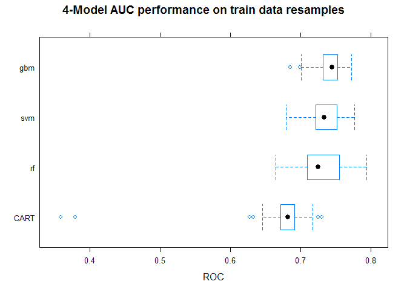 dotplot

``` r
#dotplot(cvValues, metric = "ROC")
```

``` r
rocDiffs <- diff(cvValues, metric = "ROC")
summary(rocDiffs)
```

    ## 
    ## Call:
    ## summary.diff.resamples(object = rocDiffs)
    ## 
    ## p-value adjustment: bonferroni 
    ## Upper diagonal: estimates of the difference
    ## Lower diagonal: p-value for H0: difference = 0
    ## 
    ## ROC 
    ##      gbm      CART     svm      rf      
    ## gbm            0.07804  0.00576  0.00894
    ## CART 0.000183          -0.07227 -0.06909
    ## svm  1.000000 0.000195           0.00318
    ## rf   1.000000 0.001536 1.000000

``` r
gbmpred <-  predict(gbm.mod,testX)
svmpred <-  predict(svm.tune,testX)
rfpred<-  predict(rf.tune,testX)
#nbpred<-  predict(nbFit,testX)
cartpred <- predict(rpartTune,testX)


mods <- list(gbm=gbmpred, svm=svmpred, rForests=rfpred, cart=cartpred)

get_metrics  <- function(prob_object) {
    cm <- confusionMatrix(prob_object,testData$Happy)
    df <- data.frame(accuracy=cm$overall[1], kappa=cm$overall[2],
                     sensitivity=cm$byClass[1],
                     specificity=cm$byClass[2],
                     pos.pred.value=cm$byClass[3],
                     neg.pred.value=cm$byClass[4])
    df
    }


all_mod_metrics <-  do.call(rbind, lapply(mods, get_metrics))


library(knitr)
kable(all_mod_metrics)
```

|          |  accuracy|   kappa|  sensitivity|  specificity|  pos.pred.value|  neg.pred.value|
|----------|---------:|-------:|------------:|------------:|---------------:|---------------:|
| gbm      |    0.6859|  0.3491|       0.7862|       0.5563|          0.6961|          0.6680|
| svm      |    0.6838|  0.3485|       0.7644|       0.5795|          0.7015|          0.6554|
| rForests |    0.6765|  0.3305|       0.7734|       0.5513|          0.6903|          0.6529|
| cart     |    0.6599|  0.3040|       0.7209|       0.5811|          0.6900|          0.6169|
